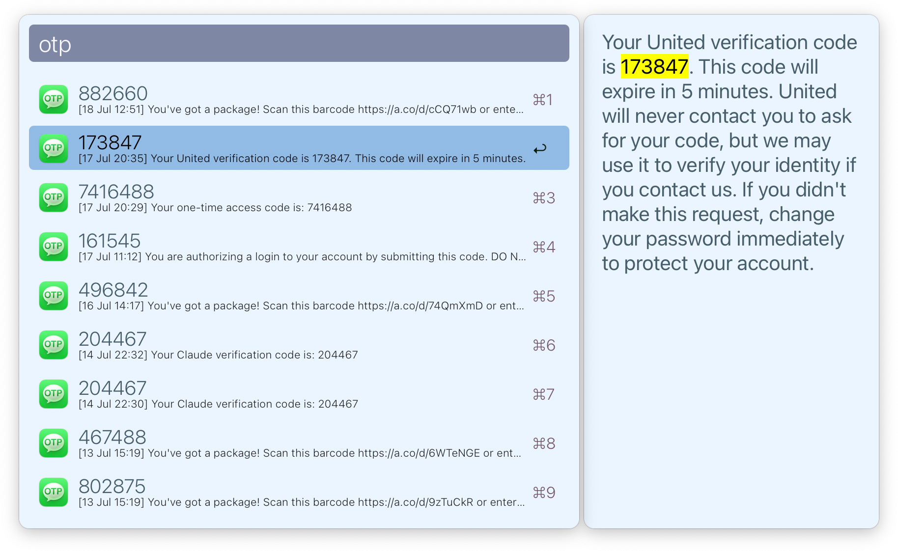

<h1 align="center">
  <br/>
  Alfred Text OTP
</h1>

[Alfred](https://alfredapp.com) workflow for extracting OTPs from text messages.

<div align="center">
    <br/>
</div>

The preview on right is optional, and only shows up if you have
[AlfredExtraPane.app](https://github.com/mr-pennyworth/alfred-extra-pane)
installed.

## Prerequisites
Before the workflow can be used, you'll need to provide Alfred with
`Full Disk Access` privileges.

Run the following command in terminal to open the preference pane:
```shell
open 'x-apple.systempreferences:com.apple.preference.security?Privacy_AllFiles'
```

> [!WARNING]
>
> `Full Disk Access` is used to provide Alfred with access to the Messages
> database. However, by providing Alfred with this access, you are providing
> **ALL** access to Alfred workflows — not just this  one.
>
> Be sure you trust your installed workflows before allowing this.

## Installation
Run the following command in terminal:
```shell
curl -sL https://raw.githubusercontent.com/mr-pennyworth/alfred-text-otp/main/install.sh | sh
```

## Related
 - [Simple 2FA Paste](https://alfred.app/workflows/thebitguru/simple-2fa-paste/)
   is an Alfred workflow that does the same as this workflow, but has the
   limitation (as documented on their site):
   > Starting with macOS Ventura, Apple changed the format of the underlying
   > database (`chat.db`) where now it saves an encoded version of the
   > message in `attributedBody` column instead of the simpler, unencoded `text`
   > column. `text` is still populated when the message is first received, but
   > gets converted to `attributedBody` at some later time. This workflow will
   > not find such converted messages.
 - [2FA Read Code](https://alfred.app/workflows/alanhe/2fa-read-code/) is
   another workflow that has the same limitation as the one above.
 - [Mouseless Messenger](https://github.com/stephancasas/alfred-mouseless-messenger)
   is an Alfred workflow that allows you to read messages in Alfred and
   send messages from Alfred. It doesn't extract OTPs, but contains the code
   to deal with `attributedBody` column in the `chat.db` database.